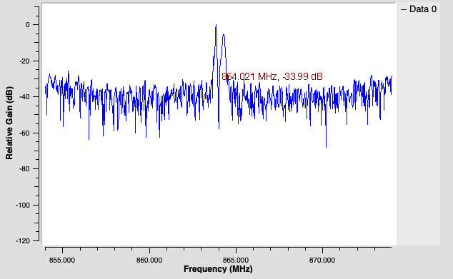

# Remote control analysis

Let's try recording a Schneider Electric store & light remote control.

Sadly the Portapack record feature is limited to 500k samples per second, but we do not have this limitation when using the HackRF in USB mode (up to 20Ms/s).

## Settings

- **Center frequency:** 864MHz (Z-wave)
- **Bandwith:** 20MHz / 20Ms/s
- **Amplifier:** 14dB antenna amp enabled, LNA/IF gain set to 8 dB, baseband gain set to 20 dB

## Receive the data

`remote-extract.raw` file will contains both 8bit I and Q (complex quadrature) signal data in the following order: `IQIQIQIQ...`

**Source**:

https://github.com/mossmann/hackrf/blob/master/host/hackrf-tools/src/hackrf_transfer.c

```c
typedef struct 
{
    char        chunkID[4]; /* 'data' */
    uint32_t    chunkSize; /* Size of data in bytes */
    /* Samples I(8bits) then Q(8bits), I, Q ... */
} t_DataChunk;
```

So, if we record at 20Ms/s during 100ms, we'll have 2 million samples, with 2 bytes per sample (I and Q), so 4MB of data.

```bash
hackrf_transfer -r remote-extract.raw -f 864000000 -s 20000000 -a 1 -l 5 -g 20
```

## Observe the data

We can use Audacity, just set the following settings to analyse the waveforms: 8 bits, signed, 2 channels (I and Q)

Here what the remote BPSK, or Binary Phase Shift Keying, https://en.wikipedia.org/wiki/Phase-shift_keying looks like:


## GNU Radio Companion

From the extracted raw 8bit file, we can perfom multiple operations in GNU Radio Companion.

First thing to do is to convert the IQ sequence bytes into a real complex value with the `IChar To Complex` bloc.

Next we'll remove the DC offset with the `DC Blocker bloc`, as there is one according to the official HackRF documentation.

> Samples produced by HackRF are measurements of radio waveforms, but the measurement method is prone to a DC bias introduced by HackRF. It's an artifact of the measurement system, not an indication of a received radio signal. DC offset is not unique to HackRF; it is common to all quadrature sampling systems.


This will produce the following FFT graph (centered at 864 MHz):


